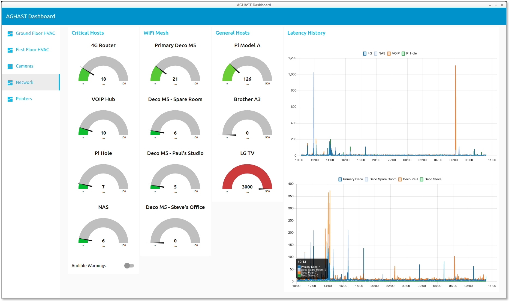

# A Go Home Automation SysTem (AGHAST)

AGHAST is primarily an automation _server_ - it does not mandate a specific front-end.
All data and controls that should be provided to end-users (i.e. not administrators) are exposed via MQTT.
Node-Red is being used as a front-end during development and example flows are provided, but other MQTT-connected dashboards could be used if prefered.



We believe that end-users of HA systems are generally not interested in the nuts and bolts, so configuration is performed entirely at the back-end by the in-house geek ;-)

## Requirements

* An MQTT Broker - development is being undertaken using Mosquitto
* An MQTT-Connected dashboard - Node-Red works well and example flows are included

## Integrations

| Integration | Description                  | Documentation |
| ----------- | :--------------------------  | ------------- |
| Time        | Includes: Tickers            | [Time](docs/Time.md) |
| Network     | Includes: HostChecker        | [](docs/) |
| DataLogger  | Log Data to CSV files        | [](docs/) |
| Daikin      | HVAC Control and Monitoring  | [Daikin](docs/Daikin.md) |
| Influx      | Log Data to InfluxDB         | [Influx](docs/Influx.md) |
| Scraper     | Web Scraping                 | [](docs/) |

## Configuration

The main configuration file `config.toml` is quite simple, containing only some general information about the system itself, and a list of enabled Integrations, eg.
```
systemName = "Our House"      # Label for the system

longitude = 43.6
latitude = "!!SECRET!!"       # Get latitude from secrets.toml

mqttBroker = "!!CONSTANT(mqttBroker)"  # Hostname or IP of MQTT Broker
mqttPort = 1883               # MQTT Broker port
mqttClientID = "aghast"       # MQTT Client ID

logEvents = false             # A LOT of stuff will be logged if this is true!

# List of Integrations we want enabled
integrations = [
  "time",
  "network",
  "datalogger",
  "daikin",
  "scraper",
]
```
Every Integration **must** have an associated `<Integration>.toml` configuration file in the same directory,
eg. `time.toml`, `daikin.toml`, etc.

N.B. Even if no special configuration is required for an enabled Integration, an empty `<Integration>.toml` configuration file must exist.

### Secrets and Constants

You may replace a **value** that you don't want to share with the special string `"!!SECRET(name)"` (even if it is a number).
AGHAST will then look for the matching name-value pair in the `secrets.toml` file and substitute the value found.

Similarly, you can replace a **value** with `"!!CONSTANT(name)"` and it will be fetched from the `constants.toml` file.
This could be especially useful in Automations, where values might be reused several times.

Currently, secrets and constants are supported for string, integer and floating-point values.

## Running

The AGHAST server may be started from the command line like this...

`./aghastServer -configdir <path/to/config/dir>`

The `-configdir` argument is compulsory and must refer to a directory containing the configuration files described above.