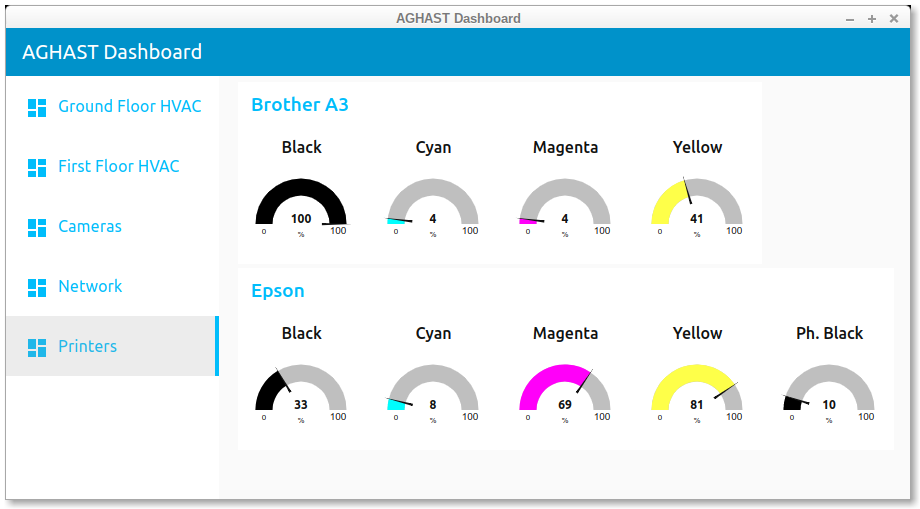

# The Scraper Integration



## Description and Purpose

The Scraper has been specifically designed for grabbing data items from web pages/interfaces.
It can grab several items in a single pass of a page.

## Configuration
The fully-commented example configuration below scrapes the web interface of a MFC-J6510DW printer.
The scraped values will be published via MQTT with this topic: `aghast/scraper/BrotherA3/Black` etc.
```
[[Scrape]]
  Name = "BrotherA3"
  URL = "http://192.168.1.17/general/status.html"
  Interval = 30               # Every hour
  Selector = ".tonerremain"   # CSS Selector to find
  Attribute = "height"        # Attribute whose value we want
  Suffix = "px"               # this will be removed from published values
  Indices = [0, 1, 2, 3]      # Which instances we want
  Subtopics = ["Black", "Yellow", "Cyan", "Magenta"] # correspond to the indices
```
 * Interval - period between scrapes, in seconds
 * Selector - a CSS Selector that locates the interesting item on the web page
 * Attribute - the value we want to grab
 * Suffix - OPTIONAL - a string to remove from the end of each value
 * Indices - a list of the occurences on the page in which we are interested, the first is numbered zero
 * Subtopics - a list, corresponding to the indices, giving the final part of the MQTT topic for each item

## Usage
See the Printers example Node-Red flow for an example of presenting the scraped data.
